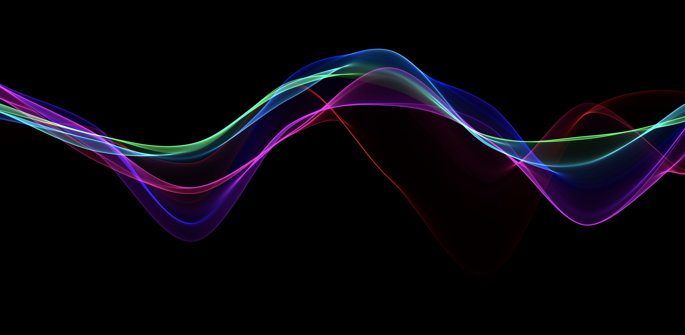

# 使用p5绘图和交互

p5.js是一个javascript库，源于Processing，基于processing的语法和写法方式。 p5的核心技术是canvas和webgl。

> P5.js有完整的一套画图功能，既可当作画图软件使用，也包括支持与各类页面元素交互的库。然而，开发者没有被限制自己的画布上，他们可以把整个浏览器页面作为自己的素描区域。正因为如此，P5.js有一个[插件库](http://p5js.org/libraries/)能够使得开发者非常容易地与其它HTML5对象（包括文本、输入、视频、网络摄像头和声音）进行交互。





##### 曲线彩线绘制简介

这个例子使用的就是p5来绘制的，主要逻辑就分两个一个setup和一个draw。setup就是在页面建立一个canvas，设置它的大小为窗口大小，渲染模式，颜色模式等。在draw绘制过程他会一直调用这个方法不停的去绘制canvas里的内容。 这个例子里做的就是在页面初始化8个点，然后以曲线的形式连接，绘制过程移动点的位置形成波澜曲线。随着时间控制波动幅度大小并控制位置居中。


##### 源码预览测试

```sh
npm install && npm run dev
```


